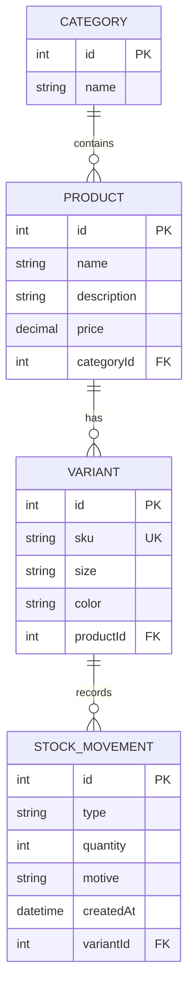

# Diseño de la solución

## 1. Enfoque

La solución está enfocada principalmente en la gestión del stock.

El catálogo está compuesto por:

- **Category**: agrupa productos.
- **Product**: pertenece a una categoría y puede tener varias variantes.
- **Variant**: representa la unidad que se vende y tiene un SKU único.

El stock se registra mediante movimientos. Cada movimiento indica si es una entrada o una salida, la cantidad, el motivo y la fecha.

La idea es mantener el historial de movimientos y obtener el stock disponible a partir de ellos.

## 2. Estructura

El código está organizado por dominio:

```text
src/
├── catalog/
│   ├── catalog-seed.service.ts
│   ├── catalog.module.ts
│   ├── category.orm-entity.ts
│   ├── product.orm-entity.ts
│   └── variant.orm-entity.ts
│
├── stock/
│   ├── movement-motive.enum.ts
│   ├── movement-type.enum.ts
│   ├── register-movement.dto.ts
│   ├── registered-movement.interface.ts
│   ├── stock-movement.orm-entity.ts
│   ├── stock.controller.ts
│   ├── stock.module.ts
│   ├── stock.service.spec.ts
│   └── stock.service.ts
│
├── app.controller.spec.ts
├── app.controller.ts
├── app.module.ts
├── data-source.ts
└── main.ts
```

Dentro de cada módulo se separan las responsabilidades principales:

- **Controller**: maneja las requests HTTP.
- **Service**: contiene la lógica de negocio.
- **DTO**: define y valida los datos recibidos.
- **ORM Entity**: representa las tablas utilizadas por TypeORM.
- **Enum**: define los valores permitidos para tipos y motivos de movimientos.

## 3. Modelo de datos

Las relaciones principales son:



La variante es la unidad que tiene stock propio. Por eso los movimientos están asociados directamente a una `Variant`.

## 4. Registro de movimientos

El endpoint principal es:

```http
POST /stock/movimientos
```

El request contiene:

```json
{
  "sku": "SKU-001",
  "type": "in",
  "quantity": 10,
  "motive": "compra"
}
```

El flujo principal es:

```text
Request
   ↓
StockController
   ↓
StockService
   ↓
Buscar Variant por SKU
   ↓
Calcular stock disponible
   ↓
Validar operación
   ↓
Registrar StockMovement
   ↓
Devolver movimiento + stock disponible
```

## 5. Decisiones de diseño

### Cantidad positiva

La cantidad siempre se recibe como un número positivo. La dirección del movimiento se define mediante `type`:

```text
in  → entrada
out → salida
```

**Por qué:** evita mezclar el significado de la cantidad con la dirección del movimiento. La request deja explícitamente qué operación se quiere realizar y la validación puede limitarse a comprobar que la cantidad sea mayor que cero.

### Stock disponible desde movimientos

```text
stock disponible = entradas - salidas
```

Antes de registrar una salida se verifica que exista stock suficiente. Si la operación dejaría el stock por debajo de cero, se rechaza y el movimiento no se registra.

**Por qué:** el historial de movimientos funciona como fuente de información para calcular el saldo. De esta manera no es necesario mantener además un valor de stock que pueda quedar desactualizado respecto de los movimientos registrados.

### Cálculo en una sola consulta

El saldo disponible se obtiene mediante una única consulta de agregación:

```sql
SELECT
    SUM(CASE WHEN type = 'in' THEN quantity ELSE 0 END)
    - SUM(CASE WHEN type = 'out' THEN quantity ELSE 0 END)
FROM stock_movement
WHERE variantId = ?
```

**Por qué:** el cálculo se realiza en la base de datos y evita cargar todos los movimientos en memoria de la aplicación para obtener el saldo.

### Motivos cerrados

Los motivos aceptados son:

```text
compra
devolucion
ajuste
```

Se utiliza un enum para mantener un conjunto cerrado de valores válidos.

**Por qué:** permite mantener un vocabulario consistente en los movimientos y evita guardar valores diferentes para representar el mismo motivo.

### `simple-enum` en las columnas de tipo y motivo

Las columnas `type` y `motive` utilizan `simple-enum` de TypeORM.

**Por qué:** la aplicación soporta PostgreSQL y SQLite. `simple-enum` permite utilizar la misma definición de entidad con ambos motores, algo útil especialmente porque los tests utilizan SQLite.

### Validación

Los datos de entrada se validan mediante DTOs y `ValidationPipe`.

Se controlan, entre otros casos:

- tipo de movimiento válido
- cantidad mayor que cero
- motivo válido
- SKU informado
- propiedades no permitidas

Los principales códigos utilizados son:

| Situación                          | HTTP |
| ---------------------------------- | ---: |
| Datos de entrada inválidos         |  400 |
| SKU inexistente                    |  404 |
| Stock insuficiente para una salida |  409 |

**Por qué:** las validaciones del request se realizan antes de llegar a la lógica de negocio. Además, `whitelist` y `forbidNonWhitelisted` permiten mantener un contrato explícito para el body de la API y rechazar propiedades que no forman parte del DTO.

### Respuesta incluye el stock disponible

Cuando el movimiento se registra correctamente, la respuesta incluye el movimiento creado y el stock disponible resultante.

**Por qué:** el cliente puede conocer el nuevo saldo como parte de la misma operación, sin tener que realizar una segunda consulta.

## 6. Seed

Se agregó un seed sencillo para disponer de categorías, productos y variantes con SKUs conocidos (`SKU-001`, `SKU-002`).

Esto facilita probar el endpoint manualmente y tener datos iniciales para desarrollo.

**Por qué:** el challenge no requiere un CRUD para el catálogo. El seed permite contar con datos para probar la funcionalidad principal sin agregar endpoints que no son necesarios para el alcance del ejercicio.

## 7. Tests

Se incluyen tests unitarios para las principales reglas del servicio y tests e2e para verificar el comportamiento del endpoint.

Entre los casos contemplados están:

- calcular el stock disponible como entradas menos salidas
- registrar una entrada
- registrar una salida
- SKU inexistente (404)
- cantidad inválida (400)
- salida con stock insuficiente (409)
- actualización del stock disponible en la respuesta

## 8. Ejecución

Instalar dependencias:

```bash
npm install
```

Copiar las variables de entorno:

```bash
cp .env.example .env
```

Levantar el proyecto:

```bash
npm run start:dev
```

La aplicación queda disponible en:

```text
http://localhost:3000
```

Para ejecutar las verificaciones:

```bash
npm run typecheck
npm run lint
npm test
npm run test:e2e
```

PostgreSQL también puede utilizarse mediante Docker:

```bash
docker compose up -d
```

La configuración correspondiente se encuentra en `.env.example`.

### Probar el endpoint

Con el seed cargado hay variantes disponibles para probar el endpoint:

```bash
# 201: registra una entrada y devuelve el nuevo stock disponible
curl -i -X POST http://localhost:3000/stock/movimientos \
  -H "Content-Type: application/json" \
  -d '{"sku":"SKU-001","type":"in","quantity":10,"motive":"compra"}'

# 409: la salida dejaría stock negativo
curl -i -X POST http://localhost:3000/stock/movimientos \
  -H "Content-Type: application/json" \
  -d '{"sku":"SKU-002","type":"out","quantity":99,"motive":"devolucion"}'

# 404: SKU inexistente
curl -i -X POST http://localhost:3000/stock/movimientos \
  -H "Content-Type: application/json" \
  -d '{"sku":"NO-EXISTE","type":"in","quantity":1,"motive":"ajuste"}'

# 400: cantidad negativa
curl -i -X POST http://localhost:3000/stock/movimientos \
  -H "Content-Type: application/json" \
  -d '{"sku":"SKU-001","type":"in","quantity":-5,"motive":"compra"}'
```
